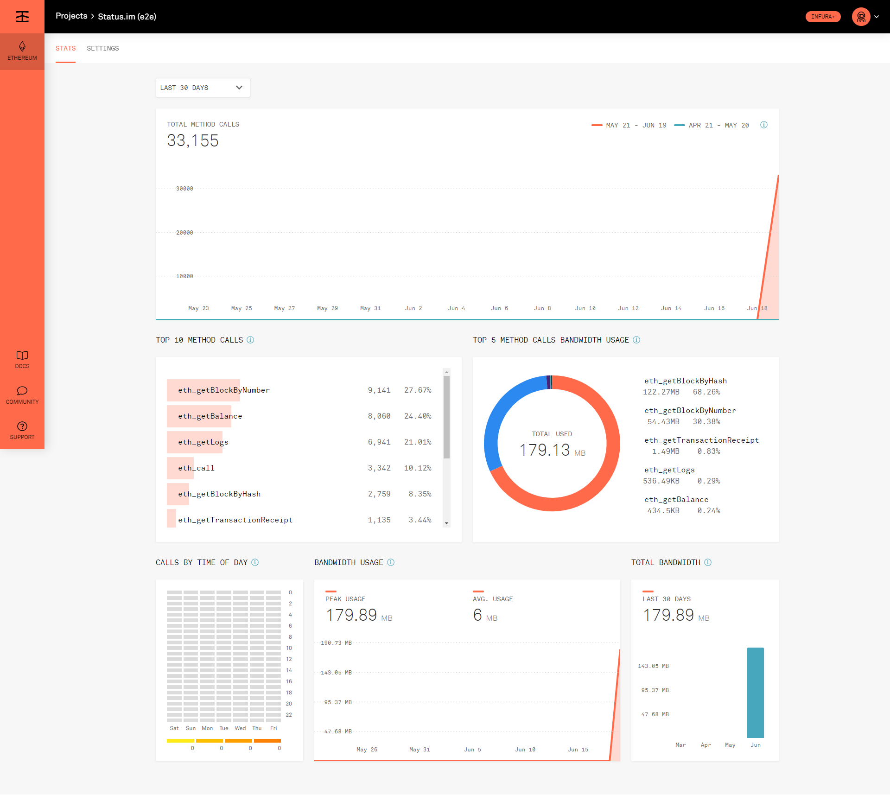

# 2020-06-26

## AFK

- [x] birthday party 🎂🎉🎊😀

---

# 2020-06-25

---

# 2020-06-24

## Issues

- [x] [status-im/team-core#7 - Allow for smooth sending and receiving of SNT while maintaining privacy](https://github.com/status-im/team-core/pull/7) - `read`

## Pulls

- [x] [status-im/specs#137 - Added public key compression specs](https://github.com/status-im/specs/pull/137) - `merged`
- [x] [status-im/specs#142 - Add release commit info for Update/key compression](https://github.com/status-im/specs/pull/142) - `submitted`, `merged`
- [x] [#1995 - Added link to specs for key compression API](https://github.com/status-im/status-go/pull/1995) - `submitted`, `merged`

---

# 2020-06-23

## Issues

- [x] [#7118 - SNT and emoji reactions**](https://github.com/status-im/status-react/issues/7118)
   - Laid out specs for emoji reactions 

## Pulls

- [x] [#1990 - Feature/key compression](https://github.com/status-im/status-go/pull/1990) - `merged`

## Reviews

- [x] [Push notification server specs](https://github.com/status-im/specs/pull/139/files) - `approved`, `feedback`

---

# 2020-06-22

## Schedule

- [x] 13:00 BST - Town Hall #60 - June 22, 2020 
   - https://www.youtube.com/watch?v=-bcUQTfNMlk
- [x] 14:30 BST - Referral program implementation sync
   - https://meet.google.com/nfd-pare-jke

## Pulls

- [x] [status-im/specs#137 - Added public key compression specs](https://github.com/status-im/specs/pull/137) - `commits`, `discussed`
- [x] [#1990 - Feature/key compression](https://github.com/status-im/status-go/pull/1990) - `commits`

---

# 2020-06-19

## Schedule

- [x] 14:00 BST - Core Retro
   - https://meet.google.com/hqw-nsfk-xoq
   - Notes - https://notes.status.im/tj1gpGX8SFeX1xLMVte-kQ?both

## Ad Hoc

- [x] Created secret infura endpoints for e2e and release builds
   - Status.im (e2e CI)
   - Status.im (release build)

## Pulls

- [x] [status-react#10850 - Updated test endpoint to new test only endpoint](https://github.com/status-im/status-react/pull/10850) - `draft`, `closed`
   - Used this draft PR to get sample statistics on e2e test RPC call consumption
     - Initial run showed a consumption of 33,155 RPC calls for a single e2e test run
     - 

## Reviews

- [x] [provide INFURA_TOKEN from credentials](https://github.com/status-im/status-react-jenkins/pull/8) - `discussed`, `approved`
- [x] [status-react#10853 - Feature/use separate e2e token](https://github.com/status-im/status-react/pull/10853) - `approved`

---

# 2020-06-18

## Schedule

- [x] 14:30 BST - Referral program implementation sync
   - https://meet.google.com/nfd-pare-jke
   - https://docs.google.com/document/d/1SHHcKZRVeEf4EzHV1juu_zX0LEfwJvh2Z04QGQYcQXQ/edit

## Ad Hoc

- [x] Created e2e and dev build infura endpoints
   - [e2e endpoint](https://mainnet.infura.io/v3/a61f40c227824c80892886c0806c748e)
   - [dev build endpoint](https://mainnet.infura.io/v3/40ec14d9d9384d52b7fbcfecdde4e2c0)

## Pulls

- [x] [#1990 - Feature/key compression](https://github.com/status-im/status-go/pull/1990) - `commits`, `discussed`
- [x] [status-im/specs#137 - Added public key compression specs](https://github.com/status-im/specs/pull/137) - `commits`, `discussed`
- [x] [#1994 - Added e2e dedicated test endpoints](https://github.com/status-im/status-go/pull/1994) - `draft`

## Reviews

- [x] [status-im/specs#138 - Add audio messages](https://github.com/status-im/specs/pull/138) - `approved`, `feedback`
- [x] [#1992 - Audio voice files](https://github.com/status-im/status-go/pull/1992) - `feedback`

---

# 2020-06-17

## Schedule

- [x] 10:00 BST - iOS Notifications
   - https://meet.google.com/bbc-ppuj-ijz
   - Notes
     - https://discuss.status.im/t/decentralized-push-notifications-for-ios/1718/11
     - https://notes.status.im/push-notifications-ios 

## Issues

- [x] [status-im/specs#136 - Document detailing the status-go binding API](https://github.com/status-im/specs/issues/136) - `created`

## Pulls

- [x] [#1990 - Feature/key compression](https://github.com/status-im/status-go/pull/1990) - `commits`, `submitted`
   - Added binary bindings for key de/compression
   - Refactor of func parameters
     - gomobile is a bit tempermental using raw bytes as a parameter, so I've decided to use string only inputs and outputs
- [x] [status-im/specs#137 - Added public key compression specs](https://github.com/status-im/specs/pull/137) - `submitted`, `commits`

## Reviews

- [x] [go-maven-resolver#4 - return non-zero exit code on resolving failures](https://github.com/status-im/go-maven-resolver/pull/4) - `approved`
- [x] [#1991 - Use the Hash of the IP address instead of the actual IP address](https://github.com/status-im/status-go/pull/1991) - `approved`, `feedback`
- [x] [Sequel Core dev call #32](https://www.youtube.com/watch?v=RRhnbGbQfdc) - `watched`

---

# 2020-06-16

## Schedule

- [x] 14:00 BST - Samuel / André 1:1
   - https://meet.google.com/pga-udvu-wpk
   - Notes
     - [#1834 - Show pending transactions](https://github.com/status-im/status-go/issues/1834)
     - [#7118 - SNT and emoji reactions**](https://github.com/status-im/status-react/issues/7118)
     - [#1937 - Compress public key for chat](https://github.com/status-im/status-go/issues/1937)
     - Stimbus
       - https://discuss.status.im/t/why-stimbus-or-organisational-focus-and-alignment/1753
       - https://discuss.status.im/t/how-stimbus-or-what-is-needed-to-start-this-work/1754

## Pulls

- [x] [#1990 - Feature/key compression](https://github.com/status-im/status-go/pull/1990) - `commits`
   - Added key decompression with key type handling
   - Added handling for '0x' type indentifying
   - Added more robust testing
   - make vendor for bls12_381
   - Added bls12-381 compression tests
   - Added decompress key expected results
   - Implemented bls12-381 decompression
  
---

# 2020-06-15

## Schedule

- [x] 13:00 BST - Bi-weekly Core Dev Call
   - https://meet.google.com/uyn-yfrq-uka
   - https://notes.status.im/core-dev-call_32?both
- [x] 14:30 BST - Referral program implementation sync
   - https://meet.google.com/nfd-pare-jke
   - Action point - Acquire better metrics
     - [Peer count](https://grafana.status.im/d/wV77E-4mz/statusd-metrics?orgId=1)
     - [Mailserver peer counts](https://grafana.status.im/d/gxQG_R1Zk/status-peers?orgId=1&refresh=5m&var-fleet=eth.prod&var-host=mail&var-type=StatusIM&var-platform=android-arm&var-platform=android-arm64&var-platform=darwin-amd64&var-platform=darwin-arm64&var-platform=linux-amd64&var-platform=android-386)
- [x] 15:00 BST - Referral x Partner Inclusion
   - https://meet.google.com/cwp-czkp-efk

## Pulls

- [x] [#1990 - Feature/key compression](https://github.com/status-im/status-go/pull/1990) - `commits`
   - Added key type identifier handling

## Reviews

- [x] [specs#105 - mentions](https://github.com/status-im/specs/pull/105) - `approved`

---

# 2020-06-12

## Issues

- [x] [#1937 - Compress public key for chat](https://github.com/status-im/status-go/issues/1937) - `research`, `commits`
   - Synced with **@arnetheduck** and **@cheatfate**
     - `<multicodec integer encoded as libp2p varint><serialized public key>`
     - identifiers need to be encoded using https://github.com/multiformats/unsigned-varint
     - keys usable on ETH 1 and ETH 2
       - `ecp256k1-pub` - `0xe7` - Secp256k1 public key
       - `bls12_381-g1-pub` - `0xea` - BLS12-381 public key in the G1 field
       - `bls12_381-g2-pub` - `0xeb` - BLS12-381 public key in the G2 field

## Posts

- [x] [Full Status Archive Nodes - A path to independence and true decentralisation](https://discuss.status.im/t/full-status-archive-nodes-a-path-to-independence-and-true-decentralisation/1747) - `discussed`

---

# 2020-06-11

## Schedule

- [x] 10:30 BST - Sync with Hester about issues
   - [Compress public key for chat](https://github.com/status-im/status-go/issues/1937)
     - Draft PR is created
     - **Sync with arnetheduck about use of `multikey`**
       - Currently the for `multikey` spec doesn't exist and only has basic groundwork
     - Spin off task is reducing the cost of ENS name reg
       - **Create issue**
       - Store only compressed key in bytes not string
       - Reduce gas price
       - Sync with Ricardo about this 
   - [Show pending transactions](https://github.com/status-im/status-go/issues/1834)
     - Outgoing transactions are easy
     - Incoming transactions inside Status ecosystem are pretty easy
     - Incoming transactions outside Status are hard
       - Infra seems to be too expensive, still pending will pursue this less vigorously
       - I've made a feature request to Infura
       - Stimbus / Nimbus desktop implementation could solve some of this
     - **Expand the use case for both contract cases**
       - Such as incoming ERC-20 and NFT tokens
       - https://github.com/status-im/contract-notifier
       - https://github.com/status-im/status-react/issues/10242
         - UI for refreshing wallet, useful functionality to initiate high frequency polls for data
   - [SNT and emoji reactions](https://github.com/status-im/status-react/issues/7118)
     - Split the issue into:
       - **emoji reactions**
         - Relatively simple to implement, requires basic message parsing
       - **SNT reactions**
         - Requires more difficult implementation(s)
         - Requires consensus on direction, **get opinions with Discuss post**, there a multiple methods
           - Yenda likes Raiden
             - Talk to Tobias about Raiden, he worked in Raiden
           - Ricardo has worked on contract accounts
- [x] 14:30 BST - Referral program implementation sync
   - https://meet.google.com/nfd-pare-jke
   - Consider other things to reward users for if onboarding is against iOS terms, as per @AK87's suggestion

## Pulls

- [x] [lokalize2android#1 - Review](https://github.com/status-im/lokalize2android/pull/1) - `commits`, `submitted`, `merged`

## Reviews

- [x] [lokalize2android](https://github.com/status-im/lokalize2android/blob/master/lokalize2android.go) - `feedback`

---

# 2020-06-10

## Schedule

- [x] 11:30 BST - Rajeev / Sam 1:1
   - https://meet.google.com/ejo-csxx-ixi
   - [specs#123 - Clarification on Status node roles](https://github.com/status-im/specs/issues/123)
- [x] 16:00 BST - Samuel / André 1:1
   - https://meet.google.com/rij-fgdg-xxe
   - Notes
     - [#1834 - Show pending transactions](https://github.com/status-im/status-go/issues/1834)
     - [#1937 - Compress public key for chat](https://github.com/status-im/status-go/issues/1937)
     - Review feedback
     - Stimbus

## Posts

- [x] [Full Status Archive Nodes - A path to independence and true decentralisation](https://discuss.status.im/t/full-status-archive-nodes-a-path-to-independence-and-true-decentralisation/1747) - `created`

## Reviews

- [x] [vacp2p/specs#142 - rename mailserver to history node](https://github.com/vacp2p/specs/pull/142) - `approved`
- [x] [status-im/specs#105 - mentions](https://github.com/status-im/specs/pull/105) - `feedback`

---

# 2020-06-09

## Schedule

- [x] 12:00 BST - Samuel / Terry - Catch up
   - https://meet.google.com/acp-ftky-cqe

## Pulls

- [x] [#1990 - Feature/key compression](https://github.com/status-im/status-go/pull/1990) - `draft`, `commits`
   - I had a lot of problems with `vendor make`
     - I needed to install `goware/modvendor` directly, `modvendor-install` was failing
   - Package unit testing caused a lot of problems because C libs were/are throwing errors.
     - For details [see here](attachments/2020-06/2020-06-09_unit-test-error-log.txt)
   - The linter is capricious and likely evil, I spent too much time trying to appease it
     - The linter seems to want every non-native package to be listed separately grouped by repo

## Reviews

- [x] [vacp2p#141 - Add rate limit by size](https://github.com/acp2p/specs/pull/141) - `reapproved`
- [x] [#1989 - Implement rate limiting by bytes](https://github.com/status-im/status-go/pull/1989) - `approved`
- [x] [#1987 - expose getContactByID method](https://github.com/status-im/status-go/pull/1987) - `approved`

---

# 2020-06-08

## Schedule

- [x] 13:00 BST - Town Hall
   - https://www.youtube.com/c/Statusim/live

## Issues

- [x] [#1834 - Show pending transactions](https://github.com/status-im/status-go/issues/1834)
   - Sync with Jarrad about costing for experimentation and rollout plan discussed with Jakub
- [ ] [#1937 - Compress public key for chat](https://github.com/status-im/status-go/issues/1937)
   - Implement binding functions for compressing and uncompressing public keys
- [x] [#1936 - Messengers acquires a lock in some methods for very long time](https://github.com/status-im/status-go/issues/1936)
   - Begin review of code for improvements

## Reviews

- [x] [vacp2p#141 - Add rate limit by size](https://github.com/acp2p/specs/pull/141) - `feedback`, `discussed`, `approved`
- [x] [#105 - mentions](https://github.com/status-im/specs/pull/105) - `feedback`

---

# 2020-06-05

## Schedule

- [x] 14:00 BST - Core Retro
  - https://meet.google.com/hqw-nsfk-xoq
  - [Notes](https://notes.status.im/mj_3vzVQQHiQC0C7DOiZSA?both)
    - Got go ahead for our own infura light, provided cost is not too high ... Need to get costings
      - [x] Samuel to schedule exploratory meeting
- [x] 15:00 BST - Nix in Status
   - https://meet.google.com/kwv-arcf-jqm
   - https://www.youtube.com/watch?v=m4sv2M9jRLg
   - https://drive.google.com/file/d/1Tt5R7QOubudGiSuZIGxuFWB1OYgcThcL
- [x] 16:00 BST - Jakub / Samuel
   - https://meet.google.com/tgb-bjqu-ehr
   - https://notes.status.im/pending-tx-infra-costs
   - https://github.com/status-im/jakubgs-notes/blob/master/research/pending_tx_infra.md

## Issues

- [x] [#1937 - Compress public key for chat](https://github.com/status-im/status-go/issues/1937) - `research`
  - Researching how to create new bindings in the `status-go` binary

## Reviews

- [x] [Adjust index to use `local_chat_id`](https://github.com/status-im/status-go/pull/1986) - `approved`, `feedback`

---

# 2020-06-04

## Schedule

- [x] 12:30 BST - Jarrad and Sam Compressed Keys
   - https://meet.google.com/dnv-otdx-jmp
   - Notes
     - [#1937 - Compress public key for chat](https://github.com/status-im/status-go/issues/1937)
       - Treat this improvement for aesthetic reasons
       - https://github.com/multiformats/multiformats
     - [#1834 - Show pending transactions](https://github.com/status-im/status-go/issues/1834)
       - Implement an archive node network.
       - Light node implementations / querying state
         - https://slock.it/incubed/
         - https://slock.it/incubed-sdk/
         - https://thegraph.com/

## Issues

- [x] [#1834 - Show pending transactions](https://github.com/status-im/status-go/issues/1834) - `discussed`
- [x] [#1937 - Compress public key for chat](https://github.com/status-im/status-go/issues/1937) - `discussed`, `research`
  - [Multiformat public keys](https://github.com/status-im/status-go/issues/1937#issuecomment-638963337)

## Pulls

- [x] [#1984 - Added basic history of the protocol package](https://github.com/status-im/status-go/pull/1984) - `merged` 

---

# 2020-06-03

## Issues

- [x] [#1937 - Compress public key for chat](https://github.com/status-im/status-go/issues/1937) - `research`, `discussed`
   - [Theoretical min and max base58 encoded compressed key lengths](https://github.com/status-im/status-go/issues/1937#issuecomment-638286734)
- [x] [vacp2p/specs#137 - Remove / deprecate Batch Ack packet type](https://github.com/vacp2p/specs/issues/137) - `created`
- [x] [vacp2p/specs#138 - Remove MessageResponse version](https://github.com/vacp2p/specs/issues/138) - `created`
- [x] [vacp2p/specs#139 - Remove confirmations-enabled from status-options](https://github.com/vacp2p/specs/issues/139) - `created`
- [x] [vacp2p/specs#140 - Change name of status-options light-node to is-light-node](https://github.com/vacp2p/specs/issues/140) - `created`

## Pulls

- [x] [status-im/specs#132 - Remove personal pronouns](https://github.com/status-im/specs/pull/132/) - `commits`, `merged`
- [x] [#1984 - Added basic history of the protocol package](https://github.com/status-im/status-go/pull/1984) - `commits`, `submitted` 

## Reviews

- [x] [go-maven-resolver#3 - Add error handling](https://github.com/status-im/go-maven-resolver/pull/3) - `feedback`, `approved`
- [x] [vacp2p/specs#135 - feature/waku-rpc](https://github.com/vacp2p/specs/pull/135) - `feedback`, `approved`
- [x] [#1985 - use EncodeToString to print []byte variables](https://github.com/status-im/status-go/pull/1985) - `approved`

---

# 2020-06-02

## Schedule

- [x] 14:00 BST - Samuel / André 1:1
   - Async ~~https://meet.google.com/pga-udvu-wpk~~
   - [#1834 - Show pending transactions](https://github.com/status-im/status-go/issues/1834)
     - Do light nodes help provide a solution for this

## Issues

- [x] [status-im/specs#134 - Implement Passive Voice / General Grammar Linter](https://github.com/status-im/specs/issues/134) - `created`

## Pulls

- [x] [status-im/specs#132 - Remove personal pronouns](https://github.com/status-im/specs/pull/132/) - `commits`, `resubmitted` 

## Reviews

- [x] [go-maven-resolver#2 - add request retries for non-404 errors](https://github.com/status-im/go-maven-resolver/pull/2) - `approved`

---

# 2020-06-01

## Schedule

- [x] 13:00 BST - Bi-weekly Core Dev Call
   - https://meet.google.com/uyn-yfrq-uka
   - [Notes](https://notes.status.im/core-dev-call_31?both)
   - [Youtube - Core Dev Call #31 - June 1, 2020](https://www.youtube.com/watch?v=yEKMJ1cdfRg)
- [x] 14:00 BST - Discussion of decentralised incoming pending transactions
  - [#1834 - Show pending transactions](https://github.com/status-im/status-go/issues/1834)
  - [Youtube - Part of the conversation](https://youtu.be/yEKMJ1cdfRg?t=2784)

## Issues

- [x] [#1834 - Show pending transactions](https://github.com/status-im/status-go/issues/1834) - `discussed`
- [x] [status-im/pm#56 - Core Dev Call 31 Agenda](https://github.com/status-im/pm/issues/56) - `discussed`

## Pulls

- [x] [status-im/specs#132 - Remove personal pronouns](https://github.com/status-im/specs/pull/132/) - `discussed`

## Reviews

- [x] [go-maven-resolver#2 - add request retries for non-404 errors](https://github.com/status-im/go-maven-resolver/pull/2) - `feedback`

---