<aside> 🚨

Work In Progress: Suggest any changes or ideas, you are welcome to participate.

Also some things may look messy, so please forgive that for now. Though feel free to point at it and complain 😭

</aside>

# Objective

The purpose of this policy is to establish a clear, open, collaborative, and structured approach for developing Status features. By engaging key stakeholders from the outset and ensuring consistent involvement throughout the feature’s lifecycle, this policy aims to improve quality, reduce rework, and align deliverables with business goals.

```mermaid
graph TD
    A[📜 Requirements Document - User Stories]
    subgraph DD [📃 Derivative Documents]
        B(✅ Acceptance Requirements)
        C(⚙️ Technical Specification)
        D(🎨 Designs)
    end
    
    A --> DD
    
    E[[💻 Implementation and Testing]]
    F[[🧪 QA and Design Review]]
    G[[🚀 Release]]
    
    DD --> E
    DD --> F
    
    E --> F
    F --> G
```

# Scope

This policy applies to all feature development projects within the Status organisation and covers the entire lifecycle of a feature, from ideation to maintenance.

# 🔑 Key Principles

## 📃 **Requirements-Driven Development**

Every feature begins with clearly defined requirements. These requirements serve as the foundation for all subsequent documentation, design, development, and testing activities.

### **Requirements Document with User Stories**

The **Requirements Document** serves as the foundation for each feature’s development. In the context of this process, user stories act as the primary way to define the requirements and communicate them across teams. By focusing on the actual needs of users, user stories provide a simple, iterative, and adaptable method of specifying and evolving requirements throughout the feature's lifecycle.

### **What is a Requirements Document?**

In this process, the **Requirements Document** is composed of a set of **user stories**, which describe the desired outcomes from the user's perspective.

### User Story

User stories follow a very simple format:

- As `<someone / something>`
- I want `<some feature>`
- so that `<the reason why>`

<aside> 📖 As **a tech professional** I want **a clear and concise description of a feature** so that **I can solve problems independently with confidence other teams share my understanding of the feature**.

</aside>

See [About implementing user stories](https://www.notion.so/About-implementing-user-stories-fc6bc6b81e54461c85cd1b793cae4e22?pvs=21)

This document also includes **acceptance criteria** and **other supporting documentation** such as designs and technical specifications to ensure clarity for the development, design, and QA teams.

### **Traceability to User Stories**

- Every **acceptance requirement**, **technical specification**, and **design** should be traceable back to its corresponding **user story**. This ensures that the feature being built aligns with the original intention and delivers the desired value to the end user.

## 🦸🦹🧛 **The Three Amigos**

A Three Amigos group is composed of a **developer**, **QA specialist**, and **designer**, responsible for a specific feature or set of features.

Multiple Three Amigos groups may operate simultaneously, each focusing on different features or components of a project. The key roles in each group are:

- **Developer**: Provides technical insights and feasibility assessments.
- **Quality Assurance (QA)**: Ensures that the requirements are testable and aligned with quality standards.
- **Designer**: Offers input on user experience and design considerations.

The Three Amigos group assigned to a feature is responsible for providing input and context throughout the feature’s lifecycle. Each group works collaboratively to ensure their feature aligns with business goals and technical requirements.

```mermaid
graph TD
    subgraph 3ag [🦸🦹🧛 Three Amigos]
      B[🧑💻 Developer]
		  C[🧑🧪 QA Specialist]
		  D[🧑🎨 Designer]
    
		  B o--o E[[Provides technical insights and feasibility assessments]]
		  C o--o F[[Ensures requirements are testable and aligned with quality standards]]
		  D o--o G[[Gives input on user experience and design considerations]]
    end

    3ag --> H[📦 Responsible for a specific feature or set of features]
    H --> I[🔄 Provides input throughout the feature’s lifecycle]
    H --> J[🎯 Ensures feature aligns with business goals and technical requirements]
```

### Multiple groups

- **Feature-specific**: Different features may require different combinations of developer, QA, and designer expertise. To accommodate this, multiple Three Amigos groups may operate concurrently, with each team focusing on specific features. This allows the organisation to scale development efforts and ensure that each feature receives focused attention from a dedicated team.
- **Contextual understanding**: Each Three Amigos group is responsible for maintaining a deep understanding of their assigned features. By involving the same team throughout the lifecycle, there is continuity in knowledge, reducing the risk of miscommunication or misunderstandings as features progress.
- **Cross-team collaboration**: If necessary, multiple Three Amigos groups can collaborate on interdependent features or provide support to each other. This ensures that all features are aligned with the overall product vision and technical roadmap.

# ♻️ Feature Development Lifecycle

Each feature follows a consistent, structured process with the involvement of the assigned Three Amigos group across the following phases:

As required and/or reasonable the Three Amigos will consult with subject experts and the program lead for input.

```mermaid
graph TD
    
    subgraph 3ag [👥 Three Amigos Group]
        X[💻 Developer]
        Y[🧪 QA Specialist]
        Z[🎨 Designer]
    end
    
	    RM[🗺️ Roadmap]
    subgraph fdl [♻️ Feature Development Lifecycle]
	    A[💭 Ideation]
	    B[📜 Requirements Document - User Stories]
	    
	    subgraph DD [📃 Derivative Documents]
        C(✅ Acceptance Requirements)
        D(⚙️ Technical Specification)
        E(🎨 Designs)
	    end
	    DD --> G[🔍 Review and Testing]
	    DD --> F[🏗️ Implementation]
	    F --> G
	    G --> H[🚀 Release]
	    H --> I[🎛️ Feedback and Maintenance]
    end
    
    RM --> A
    A --> B
    B --> DD
    
    3ag --o|Participates in| A
    3ag --o|Owns or supports with| B
    3ag --o|Participates in and gives context for| DD
    3ag --o|Participates in and/or give context for| F
    3ag --o|Participates in and/or give context for| G
    3ag --o|Participates in and/or give context for| I
```

## 1. 🗺️ **Roadmap to** 💭 **Ideation**

- **Phase**: Roadmap
    - **Goal**: Identify key initiatives and high-level business objectives that will drive the creation of new features.
    - **Three Amigos Role**: The Three Amigos will use the Roadmap as the initial input to begin a feature lifecycle.
- **Phase**: Ideation
    - **Goal**: During ideation, the Status team(s) collaborates to outline the goals and objectives of the feature. The assigned Three Amigos provide context and input on feasibility, design impact, and testing considerations.
    - **Three Amigos Role**: The Three Amigos group actively participates in this phase, consulting on technical, quality, and design concerns to shape the feature's initial concept.

## 2. 📜 **Requirements Definition**

- **Phase**: Requirements Document - User Stories
    - **Goal**:
        - The assigned Three Amigos group formalises the feature’s requirements through **user stories,** ensuring they are clear, complete, and aligned with business goals and technical constraints.
        - These stories form the **Requirements Document** and serve as the foundation for subsequent documentation.
    - **Three Amigos Role**: The group either owns or supports the creation of user stories, contributing their expertise to ensure the requirements are testable, user-centric, and technically feasible.

## 3. 📃 **Derivative Documents: Design and Technical Specification**

- **Phase**: Derivative Documents
    - **✅ Acceptance Requirements**: Defined based on the user stories, these provide the basis for validating the feature.
    - **⚙️ Technical Specification**: Created by the developer with input from QA and the designer, detailing the architecture and technical implementation plan.
    - **🎨 Designs**: Visual guidelines prepared by the designer, aligned with the user stories and technical constraints.
    - **Three Amigos Role**: The group participates in the creation and refinement of all derivative documents, providing context and ensuring they meet the overall objectives.

## 4. 🏗️ **Implementation**

- **Phase**: Implementation
    - **Goal**: Developers begin coding the feature according to the technical specification, with QA preparing test plans based on the acceptance criteria, and the designer ensuring alignment with the designs.
    - **Three Amigos Role**: The group provides ongoing input throughout the implementation phase, ensuring that development proceeds according to plan and that technical, design, and testing standards are met.

## 5. 🔍 **Review and Testing**

- **Phase**: Review and Testing
- **Goal**: After implementation, the feature undergoes a thorough review. Testing is performed based on the acceptance criteria, with the QA specialist and the design reviewer verifying that the feature meets the required quality standards.
- **Three Amigos Role**: The QA from The Three Amigos participate in the review process, ensuring that the feature aligns with the requirements, technical specifications, and design goals.

## 6. 🚀 **Release**

- **Phase**: Release
    - **Goal**: Once testing is complete, the feature is prepared for release. The Three Amigos ensure that the release plan includes any necessary documentation and support resources.
    - **Three Amigos Role**: The group oversees the final release preparation, verifying that all aspects of the feature are ready for deployment.

## 7. 🎛️ **Feedback and Maintenance**

- **Phase**: Feedback and Maintenance
    - **Goal**: After release, the Three Amigos group monitors user feedback and addresses any issues that arise. Regular maintenance ensures the feature remains functional and continues to meet user needs.
    - **Three Amigos Role**: The group remains involved post-release, managing any feedback, bug fixes, or enhancements required to maintain the feature's quality and performance.

# 📃 Documentation Structure

To support this process, the following documents are created and maintained for each feature:

- **Requirements Document**: Defines the feature’s functional and non-functional requirements, reviewed and refined by the assigned Three Amigos group.
- **Acceptance Requirements**: Derived from the initial requirements, these are used to guide testing and verification.
- **Technical Specification**: Details the implementation approach and architecture, created by the developer with input from QA and design.
- **Designs**: Visual representations and design guidelines that align with the feature’s requirements, created by the designer and reviewed by the team.

# Transparency and Continuous Context

By assigning a dedicated Three Amigos group to each feature, the process ensures that every team involved has the necessary context, reducing the likelihood of surprises or last-minute requests. This continuous involvement:

- **Reduces risk of miscommunication**: Since the same Three Amigos group is involved throughout the lifecycle of the feature, they maintain context and can make informed decisions quickly.
- **No unexpected work**: Developers, QA, and designers are fully aware of upcoming work since they are engaged from the beginning, eliminating the risk of sudden or unfamiliar tasks.
- **Cross-functional ownership**: Each Three Amigos group feels a sense of ownership over the feature, improving quality and accountability.

# Risks and Mitigation

With multiple Three Amigos groups working on various features, the following risks should be considered:

- **Risk of resource bottlenecks**: Some team members, particularly QA and designers, may be involved in several Three Amigos groups, which could overload them.
    - **Mitigation**: Manage resources carefully and ensure that team members are not overcommitted.
- **Risk of inconsistency**: If different Three Amigos groups operate independently without coordination, there could be inconsistencies across features.
    - **Mitigation**: Facilitate regular cross-team meetings or reviews to ensure alignment and maintain consistency.

Also see:

[Unified Spec Theory](https://www.notion.so/Unified-Spec-Theory-139c7d026fa04a50b310d259a7d27b21?pvs=21)

[About implementing user stories](https://www.notion.so/About-implementing-user-stories-fc6bc6b81e54461c85cd1b793cae4e22?pvs=21)